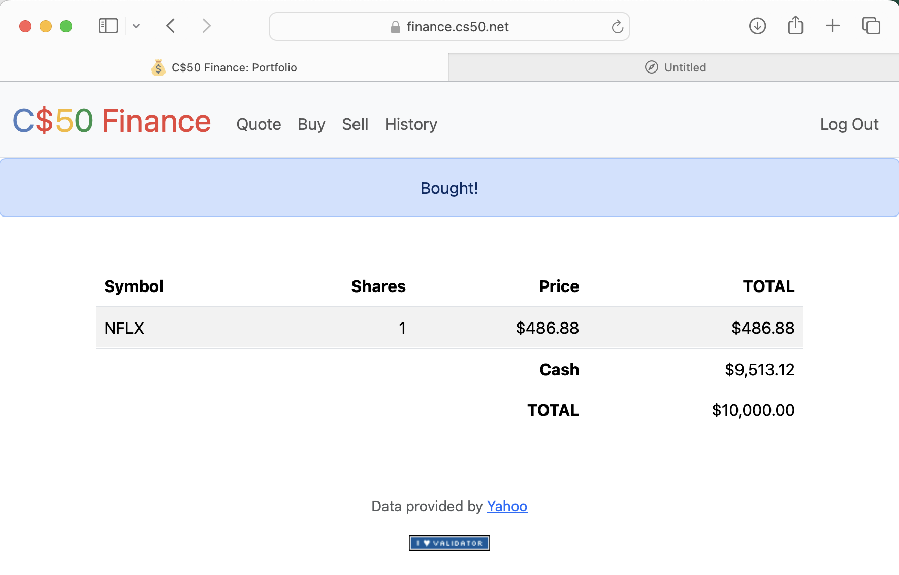

# Finance

[](https://www.python.org/)
[](https://flask.palletsprojects.com/)
[](https://getbootstrap.com/)
[](LICENSE)

**A Web Application for Stock Portfolio Management**

A robust web application that allows users to manage their stock portfolios by enabling them to buy and sell stocks, view their portfolio's value, and track transaction history—all without page reloads.

## Demo

### Application Walkthrough



## Features

- **User Authentication**: Secure login and registration system.
- **Stock Lookup**: Real-time stock price retrieval using the IEX API.
- **Buy & Sell Stocks**: Execute stock transactions with real-time price updates.
- **Portfolio Overview**: View current holdings and their values.
- **Transaction History**: Access a detailed history of all transactions.
- **Responsive Design**: Mobile-friendly interface for on-the-go access.

## Technologies Used

- **Backend**: Python, Flask
- **Frontend**: HTML, CSS (Bootstrap)
- **Database**: SQLite
- **API Integration**: IEX Cloud API for real-time stock data

## Setup

1. Clone this repository:

   ```bash
   git clone https://github.com/AmirMahdi-Tizchang/finance.git
   cd finance
   ```

2. Install dependencies:

   ```bash
   pip install -r requirements.txt
   ```

3. Set your IEX API key:

   ```bash
   export API_KEY=your_api_key_here
   ```

4. Run the application:

   ```bash
   flask run
   ```

5. Access the application at `http://127.0.0.1:5000`.

## Project Structure

```
finance/
├── application.py     # Main Flask application
├── finance.db         # SQLite database
├── helpers.py         # Helper functions
├── requirements.txt   # Python dependencies
├── static/            # CSS, JavaScript
├── templates/         # HTML templates
├── docs/              # Demo GIFs, screenshots
└── README.md          # Project documentation
```

## License

MIT License. See [LICENSE](LICENSE) for details.

## Contact

AmirMahdi Tizchang – [GitHub](https://github.com/AmirMahdi-Tizchang)
